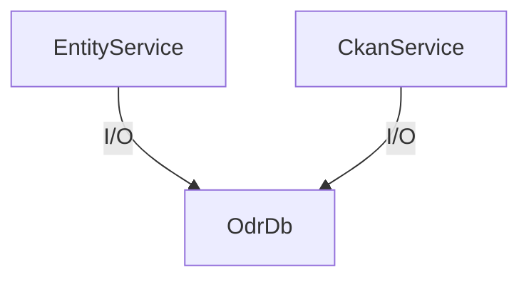
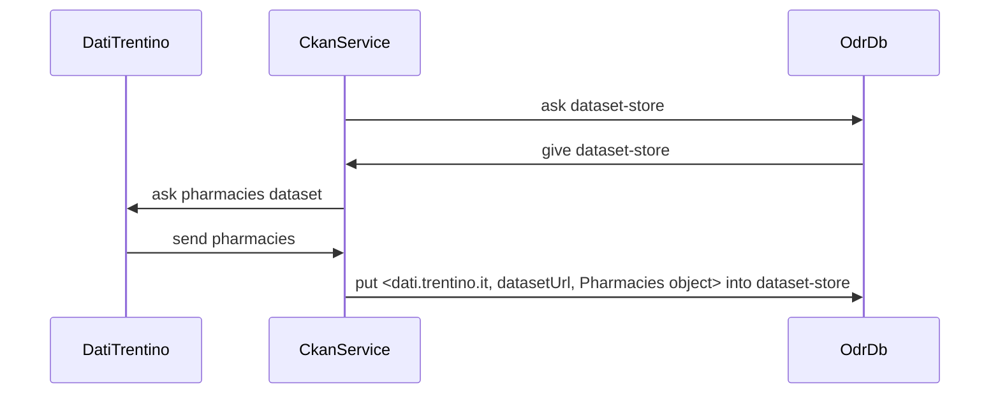

### Database

TraceProv database offers persistence and provenance tracking for objects that might come from foreign servers and over which we might have little control over.


#### Foreign objects

Foreign objects can be:

a) simple json taken from webservice. There might be available some schema (as jsonschema)
b) Mutable Java classes taken with Java client
c) Mutable Java interfaces taken with Java client
d) Immutable Java classes

Objects may be related to other objects. 


#### Database implementation
**TODO very messy**

Database implementation is abstracted by class `TraceDb`, and services read/write into it.




In particular, `OdrDb` manages `Store` objects which are simple key value tables mapped to disk:




<!--
graph TD;
	OdrDb -->|creates| dataset-store;
    CkanService -->|I/O| dataset-store;
-->

### CRUD operations

**TODO very messy**

Foreign objects read with services are wrapped in a `Controller`.

#### Controllers

**TODO very messy**

An TraceProv Controller is a wrapper for a foreign object. The controller

* is immutable
* can be converted to foreign object format
* holds url of origin server (i.e. http://dati.trentino.it)
* upon modification, holds url of origin server (i.e. http://dati.trentino.it)

##### Simple scenario

**TODO very messy**

Happens when a repository only contains urls of entities internal to it.

|originUrl|object url|dataset title|status|
|---------|---|------|---|
|http://dati.trentino.it|http://dati.trentino.it/dataset/pharmacies|Farmacccie|UNTOUCHED|
|http://odr.org|http://dati.trentino.it/dataset/pharmacies|Farmacie|MODIFIED|

After commit, we will only have

|originUrl|object url|dataset title|status|
|---------|---|------|---|
|http://dati.trentino.it|http://dati.trentino.it/dataset/pharmacies|Farmacie|UNTOUCHED|


##### Hard scenario

**TODO very messy**

Happens when a repository contains urls of entities external to it. Here having a view id helps:

**derives from view**: can be lazily computed from subvalues

|view id|originUrl|object url|name|province|residents|version|derives from view|creation timestamp|
|---------|---|------|---|--|--|--|--|--|-----------|
|1|ep|dbp:andalo|Rogereto||100|a1|-|11 nov 2014|
|2|odr|dbp:andalo|Rovereto|Trento|100|a2|1, 3 |-|
|3|dbp|dbp:andalo|Rovereto|||b1|-|13 nov 2014|

Here `view 2` is a modification of `view 1`, while `view 3` cannot be compared to other views (it's sort of on another branch)

###### Same-as table 1
This table holds unrolled cliques for fast retrieval.

|viewid|sameas view ids|
|-----|-----------|
|1|{2, 3}|
|2|{1, 3}|
|3|{1, 2}|


###### Commit
Upon commit on 1st Dec, the table transitions to

|view|originUrl|object url|dataset title|version|derives from|last synched|status|
|---------|---|------|---|--|--|--|--|
|1|ep|dbp:andalo|Farmacie|a1|-|1st dec 2014|UNTOUCHED|
|3|dbp|dbp:andalo|Farmazie|b1|-|15 nov 2014|UNTOUCHED|

###### Same-as table 2

|odrid|sameas urls|
|-----|-----------|
|1|{2}|
|3|{1}|

**IMPORTANT**: There shouldn't be the need to delete unreferenced stuff.


#### Read

**TODO very messy**

The read operation:

* looks for locally modified versions of the foreign object
* looks local cached data
* reads from service set by user in his preferences
* renews cache
* always return an immutable controller


Example for Ckan catalog:

```java
CkanCatalog datiTrentino = Catalogs.of().getCkanService().readCatalog("http://dati.trentino.it");
```

Example for entity:

```java
Entity entityCtr = Ekb.of().getEntityService().read("http://.../Andalo");
```


#### Fetch

**TODO very messy**

* reads from service set by user in his preferences (TODO probably will use Refine PreferenceStore)
* renews cache
* always return an immutable controller


```java
CkanCatalog datiTrentino = Catalogs.of().getCkanService().fetchCatalog("http://dati.trentino.it")
```

reads Ckan dataset and creates an immutable controller out of it. In scripting, we would disallow getting original CkanDataset. The read uses cached result.

```java
CkanDatasetCtr hospitals = Catalogs.of().getCkanService().readDataset("http://dati.trentino.it");
CkanDatasetCtr hospitals = Catalogs.of().getCkanService().fetchDataset("http://dati.trentino.it");
 ```


#### Synch issues

1. we read hospitals, say `h` to get controller `h1`
2. we modify `h1` in local so to create controller `h2`,  with status `MODIFIED`
3. User orders refresh of `h` for some reason, so we fetch `h` again, which was changed in the meanwhile by somebody. So what we get is controller `h3`.
	* Since fetch is forced the system tries to substitute original `h1` with `h3`
	* System discovers there is a modified version, and complains we have a conflict.

If we keep reading local cache no problem should arise
