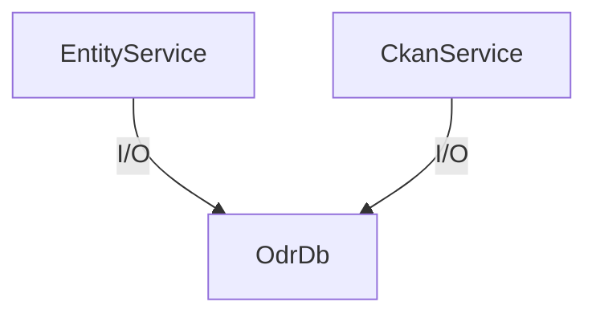
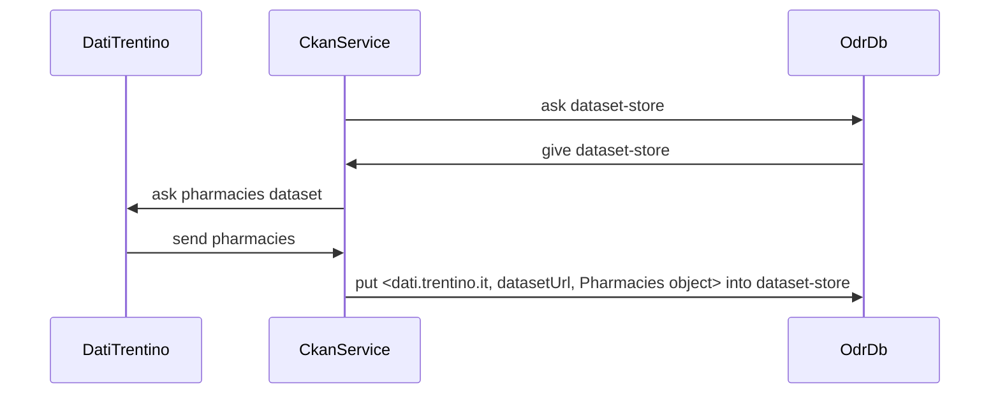

<p class="jedoc-to-strip">
WARNING: WORK IN PROGRESS - THIS IS ONLY A TEMPLATE FOR THE DOCUMENTATION. <br/>
RELEASE DOCS ARE ON THE <a href="http://opendatatrentino.github.io/traceprov/" target="_blank">PROJECT WEBSITE</a>
</p>

[TOC]

### Maven

TraceProv is available on Maven Central. To use it, put this in the dependencies section of your _pom.xml_:

```
<dependency>
    <groupId>eu.trentorise.opendata</groupId>
    <artifactId>traceprov</artifactId>
    <version>#{version}</version>
</dependency>
```

In case updates are available, version numbers follow <a href="http://semver.org/" target="_blank">semantic versioning</a> rules.

### Building objects


Most objects in TraceProv are immutable, and make heavy use of <a href="https://code.google.com/p/guava-libraries/wiki/ImmutableCollectionsExplained" target="_blank"> Guava immutable collections </a>. In TraceProv, wherever you see a class called `ASomething`, there will always be an immutable class `Something` implementing it. 

Immutable classes don't have public constructors, they only have  factory methods called `of()` or `builder()`. If the class has many fields, it will also provide a mutable Builder to create instances. So for example to build a _DcatDataset_ object setting a fields _title_ and _landingPage_ you would call:

```
DcatDataset dataset = DcatDataset
                .builder()                
                .setTitle(Dict.of(Locale.ITALIAN, "Impianti di risalita, ViviFiemme 2013"))
                .setLandingPage("http://dati.trentino.it/dataset/impianti-di-risalita-vivifiemme-2013")
                .build();

```
Builder is mutable, while dataset object created after build is perfectly immutable. 


### DCAT

<a href="http://www.w3.org/TR/vocab-dcat/" target="_blank">Dcat vocabulary</a> implementation in TraceProv tries to follow <a href=
  "https://joinup.ec.europa.eu/system/files/project/dcat-ap_version_1.1.pdf"  target="_blank">DCAT AP 1.1 specs</a>, adapting it to possibly dirty data. For spatial data we use <a href="http://geojson.org/" target="_blank">GeoJson</a> and for temporal data see <a href="https://github.com/opendatatrentino/tod-commons/wiki#dates-and-time" target="_blank">TOD Commons guidelines</a>. 

### Serialization

Serialization to/from Json is done with Jackson. In order to succesfully ser/deserialize TraceProv objects, you first need to register `TraceProvModule` and other needed modules in your own Jackson `ObjectMapper`:

```
	ObjectMapper om = new ObjectMapper();
	om.registerModule(new GuavaModule());
	om.registerModule(new TodCommonsModule());
	om.registerModule(new TraceProvModule()); 
        
	String json = om.writeValueAsString(
    					DcatDataset.builder()
                		.setTitle(Dict.of("hello"))
                .		build());
	System.out.println(json);
	DcatDataset reconstructedDataset = om.readValue(json, DcatDataset.class);
```

Notice we have also registered the necessary `Guava` (for immutable collections) and `Tod Commons` modules (for `Dict` and `LocalizedString`).
To register everything in one command just write:

```
	ObjectMapper om = new ObjectMapper();
	TraceProvModule.registerModulesInto(om);       
  
```

### Type system

TODO total work in progress..

Note: we always use fully qualified names, here for the sake of brevity we use suffix `tt`
tt = eu.trentorise.opendata.traceprov.types

Main elements are `Type`, `ClassType`, `Def` and `RefType`.

#### Type
`Type` is a type expression, which doesn't have an associated name. A type can have parameters to represent generics.


##### Simple type example

Let's consider the integer type `tt.IntType`. First, notice it is a singleton:

```java
IntType intType = IntType.of();
```

The `typeId` field is a string with the traceprov fully qualified name, suitable use in programming languages (which here happens to be the same as the Java class for `IntType`):
```java
intType.getTypeId() == "eu.trentorise.opendata.traceprov.types.IntType"
```

In concept we store the high-level most standard definition that most closely describes the datatype:
```java
intType.getConcept().getId() == "http://www.w3.org/2001/XMLSchema#int"
intType.getConcept().getName() == "int"
intType.getConcept().getDescription() == "int is ·derived· from long by setting the value of ·maxInclusive· to be 2147483647 and ·minInclusive· to be -2147483648.  The ·base type· of int is long."
```


Instances of Java Integer can hold instances of IntType:

```java
abstract class IntType extends Type {
    @Override
    public Class getJavaClass(){
        return Integer.class;
    }
}
```


##### Parametric type example
Let's say we a have a list of integers:

```java
ListType stringList = ListType.of(IntType.of());
```

The `typeId` field is a string with the java class fully qualified name, WITHOUT eventual parameters as generics:
```java
stringList.getTypeId() == "eu.trentorise.opendata.traceprov.types.ListType"
```


We said Type expressions have no assigned name, but actually they can have a name and description for the datatype they represent:

```java
abstract class ListType extends Type {
    @Override
    public Dict getName(){
        return Dict.of(Locale.ENGLISH, "List of " + getSubtype().getName().str(Locale.ENGLISH);
    }

    @Override
    public Dict getDescription(){
        return Dict.of(Locale.ENGLISH, "Traceprov list type expression");
    }

}
```

#### Definitions

**TODO OLD & WRONG**

A definition `Def` associates  a name and other semantic info like description to a type expression.

For example, the following definition associates `"com.mycompany.Person"` to class type expression:
`ClassType{age:tt.IntType, name : tt.StringType, live() : void}`

```java
Def<ClassType> myPersonDef = Def.<ClassType>builder()
							// id within traceprov for scripting. MUST be unique within
                            // the space of all def ids AND types id
							 .setId("com.mycompany.Person")
                             .setOriginId("http://mycompany.com/types/5462") // id as provided by my company web server
                             .setName(Dict.of(LOCALE.ENGLISH, "My company person"))
                             .setDescription(Dict.of(LOCALE.ENGLISH, "A brilliant person of my company"))
                             .setConcept(Concept  // hi level, loose but standard representation of our Person type
                             				.setId("https://schema.org/Person")
                                            .setName(Dict.of(Locale.ENGLISH, "Person")
                                            .setDescription("A person (alive, dead, undead, or fictional).")))
                             .setType(myPersonType)
                             .build();

```


#### ClassType
 A `ClassType` is a complex type expression made of properties and methods associated to them.  As class model we get inspiration from _Typescript_. Due to their particular nature, class expressions may also have an identifier. In the example we show the minimal identifiers required to form a class. More metadata such as natural language names, description, etc can be added to class and to each property and method.

```java
        ClassType myPersonType = ClassType
                .builder()
                .setId("org.mycompany.Person")
                .putPropertyDefs(
                        "age", // property name within the class, short, english and camelcased
                        Def
                        .builder()
                        // id for eventual condivision of property def with other types. 
                        .setId("org.mycompany.properties.age")
                        .setType(IntType.of())
                        .build())
                .putPropertyDefs(
                        "name",
                        Def
                        .builder()
                        .setId("org.mycompany.properties.name")
                        .setType(StringType.of())
                        .build())
                .putMethodDefs("walk",
                        Def
                        .builder()
                        .setId("org.mycompany.methods.walk")
                        .setType(FunctionType.of()) // todo add better example                                
                        .build())
                .build();

``` 


#### RefType
A reference to a type defined in a definition `Def`. For example, to reference the `Person` defined in the previous example, we would create a `RefType`:

```java
RefType myRef = RefType.of("com.mycompany.Person");

myRef.getDefId() == "com.mycompany.Person"
myRef.getTypeId() == "tt.RefType"
```

#### TypeContext

**TODO** Maybe it can just be a simple

```java
Map<String, Def> defs;
get/has ClassType
get/has FunctionType
```


#### Conversions

##### Date conversions

```
"10/11/2014" -> Java Date (that is number of millisecs from 1970) 38293432489234
accuracy:	0.6
```

| candidates  | score |
| ------------|-------|
| 10 Nov 2014 | 0.4|
| 11 Oct 2014 | 0.6|


```
"10/11/2014" -> Java Date (that is number of millisecs from 1970) 38293432489234
accuracy: 0.6
```

| candidates  | score | accuracy|
| ------------|-------|---------|
| 10 Nov 2014 | 0.4   | 0.6  |
| 11 Oct 2014 | 0.6   | 0.6  |


##### Name enrichment as scored converion

```
"Trento" -> id

accuracy:	0.6
```

| candidates  | score |
| ------------|-------|
| 10 Nov 2014 | 0.4|
| 11 Oct 2014 | 0.6|


"Trento (TN)" -> id
accuracy: 0.3

```
"10/11/2014" -> Java Date (that is number of millisecs from 1970) 38293432489234
accuracy: 0.6
```

| candidates  | score | accuracy|
| ------------|-------|---------|
| 10 Nov 2014 | 0.4   | 0.6  |
| 11 Oct 2014 | 0.6   | 0.6  |


### Database

TraceProv database offers persistence and provenance tracking for objects that might come from foreign servers and over which we might have little control over.


#### Foreign objects

Foreign objects can be:

a) simple json taken from webservice. There might be available some schema (as jsonschema)
b) Mutable Java classes taken with Java client
c) Mutable Java interfaces taken with Java client
d) Immutable Java classes

Objects may be related to other objects. 


#### Database implementation
**TODO very messy**

Database implementation is abstracted by class `TraceDb`, and services read/write into it.




In particular, `OdrDb` manages `Store` objects which are simple key value tables mapped to disk:




<!--
graph TD;
	OdrDb -->|creates| dataset-store;
    CkanService -->|I/O| dataset-store;
-->

### CRUD operations

**TODO very messy**

Foreign objects read with services are wrapped in a `Controller`.

#### Controllers

**TODO very messy**

An TraceProv Controller is a wrapper for a foreign object. The controller

* is immutable
* can be converted to foreign object format
* holds url of origin server (i.e. http://dati.trentino.it)
* upon modification, holds url of origin server (i.e. http://dati.trentino.it)

##### Simple scenario

**TODO very messy**

Happens when a repository only contains urls of entities internal to it.

|originUrl|object url|dataset title|status|
|---------|---|------|---|
|http://dati.trentino.it|http://dati.trentino.it/dataset/pharmacies|Farmacccie|UNTOUCHED|
|http://odr.org|http://dati.trentino.it/dataset/pharmacies|Farmacie|MODIFIED|

After commit, we will only have

|originUrl|object url|dataset title|status|
|---------|---|------|---|
|http://dati.trentino.it|http://dati.trentino.it/dataset/pharmacies|Farmacie|UNTOUCHED|


##### Hard scenario

**TODO very messy**

Happens when a repository contains urls of entities external to it. Here having a view id helps:

**derives from view**: can be lazily computed from subvalues

|view id|originUrl|object url|name|province|residents|version|derives from view|creation timestamp|
|---------|---|------|---|--|--|--|--|--|-----------|
|1|ep|dbp:andalo|Rogereto||100|a1|-|11 nov 2014|
|2|odr|dbp:andalo|Rovereto|Trento|100|a2|1, 3 |-|
|3|dbp|dbp:andalo|Rovereto|||b1|-|13 nov 2014|

Here `view 2` is a modification of `view 1`, while `view 3` cannot be compared to other views (it's sort of on another branch)

###### Same-as table 1
This table holds unrolled cliques for fast retrieval.

|viewid|sameas view ids|
|-----|-----------|
|1|{2, 3}|
|2|{1, 3}|
|3|{1, 2}|


###### Commit
Upon commit on 1st Dec, the table transitions to

|view|originUrl|object url|dataset title|version|derives from|last synched|status|
|---------|---|------|---|--|--|--|--|
|1|ep|dbp:andalo|Farmacie|a1|-|1st dec 2014|UNTOUCHED|
|3|dbp|dbp:andalo|Farmazie|b1|-|15 nov 2014|UNTOUCHED|

###### Same-as table 2

|odrid|sameas urls|
|-----|-----------|
|1|{2}|
|3|{1}|

**IMPORTANT**: There shouldn't be the need to delete unreferenced stuff.


#### Read

**TODO very messy**

The read operation:

* looks for locally modified versions of the foreign object
* looks local cached data
* reads from service set by user in his preferences
* renews cache
* always return an immutable controller


Example for Ckan catalog:

```java
CkanCatalog datiTrentino = Catalogs.of().getCkanService().readCatalog("http://dati.trentino.it");
```

Example for entity:

```java
Entity entityCtr = Ekb.of().getEntityService().read("http://.../Andalo");
```


#### Fetch

**TODO very messy**

* reads from service set by user in his preferences (TODO probably will use Refine PreferenceStore)
* renews cache
* always return an immutable controller


```java
CkanCatalog datiTrentino = Catalogs.of().getCkanService().fetchCatalog("http://dati.trentino.it")
```

reads Ckan dataset and creates an immutable controller out of it. In scripting, we would disallow getting original CkanDataset. The read uses cached result.

```java
CkanDatasetCtr hospitals = Catalogs.of().getCkanService().readDataset("http://dati.trentino.it");
CkanDatasetCtr hospitals = Catalogs.of().getCkanService().fetchDataset("http://dati.trentino.it");
 ```


#### Synch issues

1. we read hospitals, say `h` to get controller `h1`
2. we modify `h1` in local so to create controller `h2`,  with status `MODIFIED`
3. User orders refresh of `h` for some reason, so we fetch `h` again, which was changed in the meanwhile by somebody. So what we get is controller `h3`.
	* Since fetch is forced the system tries to substitute original `h1` with `h3`
	* System discovers there is a modified version, and complains we have a conflict.

If we keep reading local cache no problem should arise

### TraceEL

TraceProv Expression Engine

Rationale: all expressions must be valid Javascript ES6 expressions


`$` is the root, but is not mandatory to start expression with it (unless you're accessing some stringy field like in `$["my field"]`)

```

Expr
|
|- Token
|
Path
|
PropertyPath     myProp.otherProp     $["my Prop"]["Other Prop"]

Expr examples:
let x = 5; props["some field"].makeNice(someParams, x)[4]

Token examples:
ID:			myId
DEF:		let ID = EXPR
ENTRY:		(ID | STRING_LITERAL) : EXPR
ENVEXPR:  	DEF; EXPR
ARRAY:		[EXPRs]
OBJECT:		{ENTRYs}
INDEX:		[i]
                            (x[e]) x : array,  e : integer)
PROPERTY: 		[e]
							(x[e]) x : object,  e : string)
			|	.ID

FUNCALL:  	ID(EXPRs)           makeNice()
LAMBDA:   	(IDs)=>EXPR		    (x)=>x*2
STRING_LITERAL:		"my String"
INT_LITERAL:		5
DOUBLE_LITERAL:		3.4
LiTERAL:  	   	INT_LITERAL
			|	DOUBLE_LITERAL
			|  	STRING_LITERAL

```

### TraceQuery

There is no widely used standard query language for json / javascript objects. `XPath` is the most well known tree query language, but it is only for xml. There is an equivalent `JsonPath` language, but it has no formal specs and many implementations. Also, it looks like json/javascript but it is not valid javascript. For this reason we adopt JsonPath but changing some symbols so it it remains valid Javascript. The expressions can be made parseable by using <a href="https://developer.mozilla.org/en-US/docs/Web/JavaScript/Reference/Global_Objects/Proxy" target="_blank">ES6 Proxies</a> todo write more.

| JsonPath                  |TraceQuery| Description                                                        ||
| :------------------------ | |:----------------------------------------------------------------- |
| `$`                       | `T` |The root element to query. This starts all path expressions.       |
| `@`                       | `NODE`|The current node being processed by a filter predicate.            |
| `*`                       | `ALL`|Wildcard. Available anywhere a name or numeric are required.       |
| `..`                      | `.DEEP.`|Deep scan. Available anywhere a name is required.                  |
| `.<name>`                 |  `.<name>`|Dot-notated child                                                  |
| `['<name>' (, '<name>')]` | better not use comma (although with some wizardry we could use Javascript comma operator)|Bracket-notated child or children                                  |
| `[<number> (, <number>)]` |  better not use comma (although with some wizardry we could use Javascript comma operator)|Array index or indexes                                             |
| `[start:end]`             | `[SLICE(start,end)]`|Array slice operator                                               |
| `[?(<expression>)]`       |`[FILTER(<expression>)]` |Filter expression. Expression must evaluate to a boolean value.    |

### Modellings CSVs

  Suppose we have an original CSV table like this:
  
  ```
       h1,h2
       aa,ab
       ba,bb
  ```
  
  its JSON view format is supposed to be like this:
 
  ```json
   [
       ["h1","h2"],
       ["aa","ab"],
       ["ba","bb"]
   ]
  ```
  <p>
  We don't use an array of records as original header names may be empty or
  duplicated. Thus cell `ba` can be pinpointed with the TracePath expression
  `T[2][0]` (preferred) or `2.0` . First one is preferred as it is clearer and
  closer in syntax to Javascript<br/>
  The first column can be selected with JsonPath expression `T[ALL][0]` (preferred)
  or `ALL.0`
  </p>
  
  Once CSV is correctly loaded and transformed in a proper common tree
  representation, then we can afford to have a more user friendly version with
  records like this:

```json
       [
           {
               "h1":"aa",
               "h2":"ab"
           },
           {
               "h1":"ba",
               "h2":"bb"
           }
       ]
```

  First column can be selected with TracePath `T[ALL].h1` (preferred) or `ALL.h1`
  


### Logging

TraceProv uses native Java logging system (JUL). If you have an application which uses SLF4J logging system and want to see TraceProv logs, you can route logging with <a href="http://mvnrepository.com/artifact/org.slf4j/jul-to-slf4j" target="_blank">JUL to SLF4J bridge</a>, just remember <a href="http://stackoverflow.com/questions/9117030/jul-to-slf4j-bridge" target="_blank"> to programmatically install it first. </a>